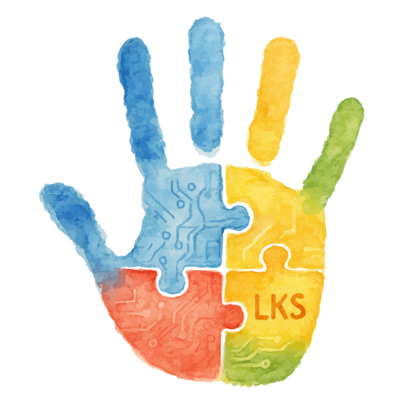

# Lukas Coin (LKS) 🌟

**[See README in spanish](README.md)** 🇨🇱

**A purpose-driven cryptocurrency: Enhancing learning and communication for autism**

## What is Lukas Coin?

**Lukas Coin (LKS)** is a non-profit solidarity token created in Chile, combining technology, inclusion, augmentative communication, and autism awareness.

Inspired by Lukas, a Chilean child with autism, this project aims to **break barriers**, **empower communities**, and **connect families** through accessible Web3 tools and transparent blockchain technology.

## Our Vision

- 🌎 Positively impact thousands of families
- 🤝 Create open-source, free technological tools
- 🧠 Integrate innovative, accessible and adapted educational systems

---

## Why "Lukas"?

The name **Lukas Coin** comes from a powerful cultural coincidence:

- In Chile, "1 luka" = 1,000 pesos, "10 lukas" = 10,000 pesos
- For us, **1 LKS = 1,000 smiles** generated by improving the lives of autistic children

It's a tribute to everyday life and how small changes (like coins or gestures) can transform realities.

---

## Technological Pillars

| Technology | Application                                                    |
| ---------- | -------------------------------------------------------------- |
| BCI        | Brain-computer interfaces for non-verbal children              |
| PECS 2.0   | Collaborative image bank created by autistic adults            |
| Floortime  | Video games interpreting movements as communication            |
| Blockchain | Total transparency in donations and community-driven decisions |

---

## Use Cases

- Community voting for project decisions
- Rewards for developers, creators, and volunteers
- Transparent donations with blockchain traceability

---

## Token Details

- Main Network: Polygon PoS
- Symbol: LKS
- Decimals: 18
- Total Supply: 42,000,000 LKS
- Initial Supply: 2,100,000 LKS (reserved for community, governance, development and inspiration)

---

## Token Contract

- Contract Address:  
  `0x31EF5a8a8Fa124D7270543c1095A45381740c490`

- Explorer:  
  [View on Polygonscan](https://polygonscan.com/token/0x31EF5a8a8Fa124D7270543c1095A45381740c490)

---

## How to Add LKS to Your Wallet

1. Open your wallet and select the **Polygon** network
2. If you don't have Polygon configured, use the following settings:

- Network Name: Polygon Mainnet
- RPC URL: https://polygon-rpc.com
- Chain ID: 137
- Currency Symbol: MATIC
- Explorer: https://polygonscan.com

3. Click on 'Import Token' or 'Add Custom Token'
4. Paste the contract address and confirm:

- Symbol: LKS
- Decimals: 18

---

## How to Get LKS?

- Contributing to the project
- Participating in events, voting, and development activities
- Donating MATIC, ETH, or BNB to our official wallet

**Official Wallet (multi-chain):**  
`0xC8CA1999b506E403b458A59b59DF2868d1A258AE`  
(compatible with ETH, POL, BNB, and LKS)

---

## How to Contribute?

**[See CONTRIBUTING.md](CONTRIBUTING.md)**

---

## 💙 Donations & Support

Lukas Coin is a 100% non-profit project.

If you believe in inclusive technology, free educational tools, and building a better future for families of autistic children — your contribution makes a difference.

Official Wallet (multi-chain): `0xC8CA1999b506E403b458A59b59DF2868d1A258AE`

Supported networks:
ETH - POLYGON - BNB - LKS

Your help fuels impact. Thank you for being part of our community 💙

---

## Resources and Useful Links

- [GitHub Repository](https://github.com/rgdevment/LukasCoin)
- [Token Contract on Polygonscan](https://polygonscan.com/token/0x31EF5a8a8Fa124D7270543c1095A45381740c490)

---

¿Ready to spread smiles and innovation?  
Join us — help build a more inclusive future with Lukas Coin 🌟

**[See README in spanish](README.md)** 🇨🇱
