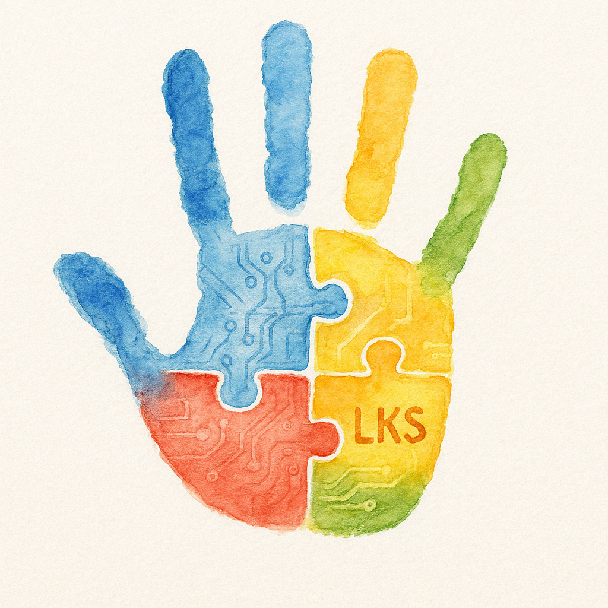

# Lukas Coin (LKS) 🌟

**[Ver README en inglés](README.en.md)** 🇺🇸

**Criptomoneda con causa: Potenciando el aprendizaje y la comunicación en el autismo**

## ¿Qué es Lukas Coin?

**Lukas Coin (LKS)** es un token solidario sin fines de lucro, creado en Chile, que combina tecnología, inclusión, comunicación aumentativa y concientización sobre el autismo.

Inspirado en Lukas, un niño chileno con autismo, este proyecto busca **romper barreras**, **empoderar comunidades** y **conectar familias** a través de herramientas Web3, accesibles y transparentes.

## Nuestra Visión

- 🌎 Impactar positivamente a miles de familias
- 🤝 Crear herramientas tecnológicas abiertas y gratuitas
- 🧠 Integrar sistemas educativos innovadores, accesibles y adaptados

---

## 🧩 ¿Por qué "Lukas"?

El nombre **Lukas Coin** nace de una coincidencia cultural poderosa:

- En Chile, "1 luka" = 1.000 pesos, "10 lukas" = 10.000 pesos
- Para nosotros, **1 LKS = 1.000 sonrisas** generadas al mejorar la vida de niños autistas

Es un guiño a lo cotidiano y a cómo pequeños cambios (como monedas o gestos) pueden transformar realidades.

---

## 🚀 Pilares Tecnológicos

| Tecnología     | Aplicación                                                   |
| -------------- | ------------------------------------------------------------ |
| BCI            | Interfaces cerebro-computadora para niños no verbales        |
| PECS 2.0       | Banco de imágenes colaborativo creado por adultos autistas   |
| Floortime      | Videojuegos que interpretan movimientos como lenguaje        |
| Blockchain     | Transparencia total en donaciones y decisiones comunitarias  |

---

## 🌟 Casos de Uso

- Votaciones comunitarias en decisiones del proyecto
- Recompensas a desarrolladores, creadores y voluntarios
- Donaciones transparentes y trazables en la blockchain

---

## 🪙 Detalles Técnicos

- Red principal: Polygon PoS
- Símbolo: LKS
- Decimales: 18
- Suministro total: 42.000.000 LKS
- Suministro inicial: 2.100.000 LKS (reservado para comunidad, gobernanza, desarrollo e inspiración)

---

## 🔍 Contrato del Token

- Dirección del contrato:  
  `0x31EF5a8a8Fa124D7270543c1095A45381740c490`

- Explorador:  
  [Ver en Polygonscan](https://polygonscan.com/token/0x31EF5a8a8Fa124D7270543c1095A45381740c490)

---

## 📲 ¿Cómo agregar LKS a tu wallet?

1. Abre tu billetera y selecciona la red **Polygon**
2. Si no tienes Polygon configurada, usa los siguientes datos:

    - Nombre: Polygon Mainnet
    - RPC URL: https://polygon-rpc.com
    - Chain ID: 137
    - Símbolo: MATIC
    - Explorador: https://polygonscan.com

3. Haz clic en 'Importar token' o 'Agregar token personalizado'
4. Pega la dirección del contrato y confirma:

    - Símbolo: LKS
    - Decimales: 18

---

## 💸 ¿Cómo obtener LKS?

- Contribuyendo activamente al proyecto
- Participando en eventos, votaciones y desarrollo
- Donando en MATIC, ETH o BNB a nuestra wallet oficial

**Wallet Oficial (multi-red):** `0xC8CA1999b506E403b458A59b59DF2868d1A258AE`

---

## 🤝 ¿Cómo contribuir?

**[Ver CONTRIBUTING.md](CONTRIBUTING.md)**

---

## 💙 Donaciones y Apoyo

Lukas Coin es un proyecto 100% sin fines de lucro.

Si quieres apoyarnos y ayudarnos a crear más herramientas educativas, inclusivas y tecnológicas puedes enviar una donación directa en cripto:

Wallet Oficial (multi-red): `0xC8CA1999b506E403b458A59b59DF2868d1A258AE`

Compatible con:  
ETH - POLYGON - BNB - LKS

Gracias por ser parte de esta comunidad 💙

---

## 🔗 Recursos y enlaces útiles

- [Repositorio en GitHub](https://github.com/rgdevment/LukasCoin)
- [Contrato en Polygonscan](https://polygonscan.com/token/0x31EF5a8a8Fa124D7270543c1095A45381740c490)

---

¿Te gustaría leer esta página en inglés?  
**[Ver README en inglés](README.en.md)** 🇺🇸
