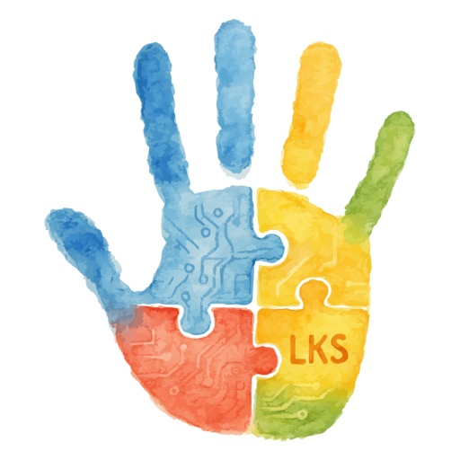

# Lukas Coin (LKS) 🌟

English Version: [README.en.md](README.en.md) 🇺🇸

Status: Proyecto Activo   |   Licencia: MIT   |   Red Principal: Polygon

Lukas Coin (LKS) es una criptomoneda solidaria chilena enfocada en mejorar la calidad de vida de niños y familias con autismo, integrando tecnología Web3, transparencia y herramientas educativas abiertas.

---

## Tabla de Contenido

- [¿Qué es Lukas Coin?](#que-es-lukas-coin)
- [Nuestra Visión](#nuestra-vision)
- [¿Por qué Lukas?](#por-que-lukas)
- [Pilares Tecnológicos](#pilares-tecnologicos)
- [Casos de Uso](#casos-de-uso)
- [Detalles Técnicos](#detalles-tecnicos)
- [Metadata Token](#metadata-token-infojson)
- [Contrato del Token](#contrato-del-token)
- [Cómo agregar LKS a tu wallet](#como-agregar-lks-a-tu-wallet)
- [Cómo obtener LKS](#como-obtener-lks)
- [Cómo contribuir](#como-contribuir)
- [Donaciones y Colaboración](#donaciones-y-colaboracion)
- [Recursos y enlaces útiles](#recursos-y-enlaces-utiles)

---

## ¿Qué es Lukas Coin?

Lukas Coin (LKS) es un token solidario sin fines de lucro, creado en Chile, que combina tecnología, inclusión, comunicación aumentativa y concientización sobre el autismo.

Inspirado en Lukas, un niño chileno con autismo, este proyecto busca romper barreras, empoderar comunidades y conectar familias a través de herramientas Web3 accesibles y transparentes.

---

## Nuestra Visión

- Impactar positivamente a miles de familias.
- Crear herramientas tecnológicas abiertas y gratuitas.
- Integrar sistemas educativos innovadores, accesibles y adaptados.

---

## ¿Por qué Lukas?

En Chile:

1 luka = 1.000 pesos
10 lukas = 10.000 pesos

Para nosotros:

1 LKS = 1.000 sonrisas

Es un guiño a lo cotidiano y a cómo pequeños cambios pueden transformar realidades.

---

## Pilares Tecnológicos

| Tecnología | Aplicación                                                  |
| ---------- | ----------------------------------------------------------- |
| BCI        | Interfaces cerebro-computadora para niños no verbales       |
| PECS 2.0   | Banco de imágenes colaborativo creado por adultos autistas  |
| Floortime  | Videojuegos que interpretan movimientos como lenguaje       |
| Blockchain | Transparencia total en donaciones y decisiones comunitarias |

---

## Casos de Uso

- Votaciones comunitarias en decisiones del proyecto.
- Recompensas a desarrolladores, creadores y voluntarios.
- Donaciones transparentes y trazables en la blockchain.

---

## Detalles Técnicos

Red Principal: Polygon PoS
Símbolo: LKS
Decimales: 18
Suministro Total: 42.000.000 LKS
Suministro Inicial: 2.100.000 LKS

---

## Metadata Token (info.json)

Puedes encontrar la metadata oficial del token para integración en wallets o exploradores:

Ver info.json (RAW):
https://raw.githubusercontent.com/rgdevment/LukasCoin/main/resources/info.json

---

## Contrato del Token

Dirección del contrato:
0x31EF5a8a8Fa124D7270543c1095A45381740c490

Explorador:
https://polygonscan.com/token/0x31EF5a8a8Fa124D7270543c1095A45381740c490

---

## Cómo agregar LKS a tu wallet

1. Abre tu billetera y selecciona la red Polygon.
2. Si no tienes Polygon configurada:

   Nombre: Polygon Mainnet
   RPC URL: https://polygon-rpc.com
   Chain ID: 137
   Símbolo: MATIC
   Explorador: https://polygonscan.com

3. Importa el token personalizado:

   Dirección: 0x31EF5a8a8Fa124D7270543c1095A45381740c490
   Símbolo: LKS
   Decimales: 18

---

## Cómo obtener LKS

- Contribuyendo activamente al proyecto.
- Participando en eventos, votaciones y desarrollo.
- Donando en MATIC, ETH o BNB a nuestra wallet oficial.

Wallet Oficial (multi-red):
0xC8CA1999b506E403b458A59b59DF2868d1A258AE

---

## Cómo contribuir

Revisa nuestras guías y lineamientos para contribuir:

Ver [CONTRIBUTING.md](CONTRIBUTING.md)

---

## Donaciones y Colaboración

Hay muchas formas de colaborar y ser parte de Lukas Coin:

- Aportar con desarrollo, sugerencias, Pull Requests, nuevas tecnologías, ideas, imágenes, recursos o propuestas.
- Participar en eventos comunitarios, actividades colaborativas o discusiones abiertas.
- Difundir el proyecto en redes y ayudarnos a llegar a más familias y desarrolladores.

También puedes solicitar tus LKS por un aporte voluntario desde https://www.lukascoin.cl. Aunque son simbólicos, aportan mucho valor en desarrollo, investigación y crecimiento de la comunidad. Además, reflejan el valor intrínseco de querer mejorar la vida de todos.

Si deseas apoyarnos económicamente puedes enviar donaciones en: ETH - POLYGON - BNB - LKS

Wallet Oficial:
0xC8CA1999b506E403b458A59b59DF2868d1A258AE

Gracias por ser parte de esta comunidad 💙

---

## Recursos y enlaces útiles

Repositorio en GitHub:
https://github.com/rgdevment/LukasCoin

Contrato en Polygonscan:
https://polygonscan.com/token/0x31EF5a8a8Fa124D7270543c1095A45381740c490

---

English Version: [README.en.md](README.en.md) 🇺🇸

---
Made with ❤️ in Chile by rgdevment
